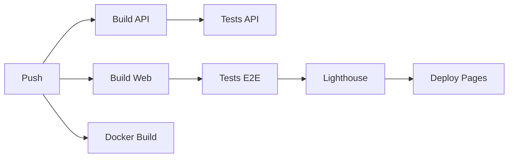

# Notas Rápidas PWA

**Progressive Web App de bloco de notas com categorias, busca e widget de clima integrado**

[](https://github.com/g0bss/my-chrome-extension/actions)
[](https://g0bss.github.io/my-chrome-extension/)

> Projeto desenvolvido como parte do Bootcamp de programação - Entrega III (PWA completo)

---

## Funcionalidades

### Bloco de Notas Avançado
- Criar, editar e excluir notas
- Organização por categorias/tags (Trabalho, Pessoal, Ideias, Urgente, Estudos)
- Busca em tempo real (título, conteúdo e tags)
- Filtros por categoria
- Armazenamento local com IndexedDB (fallback para localStorage)

### Widget de Clima
- Clima atual baseado na localização do usuário
- Integração com OpenWeatherMap API
- Temperatura, sensação térmica e descrição
- Ícones emoji representativos

### PWA Features
- Manifest Web App válido
- Service Worker para cache offline
- Installability (Add to Home Screen)
- Cache-First para assets estáticos
- Network-First para chamadas de API
- Performance otimizada (Lighthouse score ≥ 80)

---

## Arquitetura

```
my-chrome-extension/
├── apps/
│   ├── web/                      # Frontend PWA (Vite + Vanilla JS)
│   │   ├── public/
│   │   │   ├── manifest.webmanifest
│   │   │   ├── sw.js            # Service Worker
│   │   │   └── icons/
│   │   ├── src/
│   │   │   ├── main.js          # App principal
│   │   │   ├── notesManager.js  # Gerenciamento de notas (IndexedDB)
│   │   │   ├── weatherWidget.js # Widget de clima
│   │   │   └── styles.css
│   │   ├── index.html
│   │   ├── vite.config.js
│   │   ├── Dockerfile
│   │   └── package.json
│   │
│   └── api/                      # Backend API (Node/Express)
│       ├── src/
│       │   ├── index.js         # Servidor Express
│       │   └── routes/
│       │       └── weather.js   # Proxy para OpenWeatherMap
│       ├── Dockerfile
│       └── package.json
│
├── tests/
│   └── e2e/                      # Testes E2E (Playwright)
│       └── pwa.spec.js
│
├── .github/
│   └── workflows/
│       └── ci.yml               # CI/CD (GitHub Actions)
│
├── docker-compose.yml
├── playwright.config.js
├── lighthouserc.json
└── README.md
```

### Stack Tecnológica

| Camada | Tecnologia |
|--------|------------|
| **Frontend** | Vite + Vanilla JavaScript |
| **Backend** | Node.js + Express |
| **API Externa** | OpenWeatherMap API |
| **Storage** | IndexedDB (+ localStorage fallback) |
| **Containerização** | Docker + Docker Compose |
| **Testes E2E** | Playwright |
| **CI/CD** | GitHub Actions |
| **Deploy** | GitHub Pages (PWA) |
| **PWA** | Service Worker + Web App Manifest |

---

## Instalação e Uso

### Pré-requisitos

- Node.js 20+
- Docker & Docker Compose
- Git

### 1. Clonar o Repositório

```bash
git clone https://github.com/g0bss/my-chrome-extension.git
cd my-chrome-extension
```

### 2. Configurar API Key (OpenWeatherMap)

1. Obtenha uma chave gratuita em [https://openweathermap.org/api](https://openweathermap.org/api)
2. Crie o arquivo `.env` na raiz:

```bash
cp .env.example .env
```

3. Edite `.env` e adicione sua chave:

```env
OPENWEATHER_API_KEY=sua_chave_aqui
```

### 3. Opção A: Rodar com Docker Compose (Recomendado)

```bash
# Build das imagens
docker-compose build

# Subir os serviços
docker-compose up

# Acesse:
# - PWA: http://localhost:8080
# - API: http://localhost:3000
```

### 3. Opção B: Rodar Localmente (Desenvolvimento)

#### Instalar dependências

```bash
npm run install:all
```

#### Rodar API (Terminal 1)

```bash
cd apps/api
cp .env.example .env
# Editar .env com sua API key
npm run dev
```

#### Rodar PWA (Terminal 2)

```bash
cd apps/web
npm run dev
# Acesse http://localhost:8080
```

---

## Testes

### Testes E2E (Playwright)

```bash
# Rodar testes
npm run test:e2e

# Modo UI interativo
npm run test:e2e:ui

# Ver relatório
npm run test:e2e:report
```

### Lighthouse CI

```bash
# Rodar auditoria PWA/Performance
npm run lighthouse
```

---

## Deploy

### GitHub Pages (Automático)

O deploy para GitHub Pages é automático via GitHub Actions ao fazer push na branch `main`:

1. Build da aplicação
2. Testes E2E
3. Lighthouse CI
4. Deploy automático

**URL:** [https://g0bss.github.io/my-chrome-extension/](https://g0bss.github.io/my-chrome-extension/)

### Configuração do GitHub Pages

1. Vá em **Settings > Pages**
2. Source: **GitHub Actions**
3. Permissões de workflow habilitadas

---

## API Endpoints

### Backend API (http://localhost:3000)

| Método | Endpoint | Descrição |
|--------|----------|-----------|
| `GET` | `/health` | Health check |
| `GET` | `/api/weather?city=SaoPaulo` | Clima por cidade |
| `GET` | `/api/weather?lat=-23.5&lon=-46.6` | Clima por coordenadas |

### Exemplos

```bash
# Health check
curl http://localhost:3000/health

# Clima de São Paulo
curl http://localhost:3000/api/weather?city=SaoPaulo

# Clima por coordenadas
curl "http://localhost:3000/api/weather?lat=-23.5505&lon=-46.6333"
```

---

## Docker

### Serviços

```yaml
services:
  api:    # Backend Node/Express (porta 3000)
  web:    # Frontend PWA com Nginx (porta 8080)
```

### Comandos Úteis

```bash
# Build
npm run docker:build

# Subir serviços
npm run docker:up

# Parar serviços
npm run docker:down

# Ver logs
docker-compose logs -f

# Rebuild específico
docker-compose build web
docker-compose up web
```

---

## CI/CD (GitHub Actions)

### Pipeline



### Jobs

1. **build-and-test**
   - Instala dependências
   - Build de API e Web
   - Testes E2E (Playwright)
   - Lighthouse CI
   - Upload de artefatos

2. **docker-build**
   - Valida build do Docker Compose

3. **deploy**
   - Deploy automático para GitHub Pages (apenas em `main`)

### Artefatos Gerados

- `web-dist/` - Build da aplicação
- `playwright-report/` - Relatório de testes E2E
- `lighthouse-report/` - Relatório Lighthouse

---

## Estrutura de Dados (IndexedDB)

### Schema da Nota

```javascript
{
  id: "note_1234567890_abc123",
  title: "Título da Nota",
  content: "Conteúdo da nota...",
  tags: ["trabalho", "urgente"],
  createdAt: 1699876543210,
  updatedAt: 1699876543210
}
```

### Tags Disponíveis

- `trabalho` - Notas de trabalho
- `pessoal` - Notas pessoais
- `ideias` - Ideias e brainstorming
- `urgente` - Tarefas urgentes
- `estudos` - Conteúdo de estudo

---

## Service Worker

### Estratégias de Cache

**Cache-First** (assets estáticos):
- HTML, CSS, JS, ícones
- Serve do cache primeiro, atualiza em background

**Network-First** (API):
- Chamadas `/api/*`
- Tenta rede primeiro, fallback para cache offline

### Cache Name

```javascript
const CACHE_NAME = 'notas-pwa-v1';
```

---

## Contribuindo

1. Fork o projeto
2. Crie uma branch (`git checkout -b feature/nova-feature`)
3. Commit suas mudanças (`git commit -m 'feat: adiciona nova feature'`)
4. Push para a branch (`git push origin feature/nova-feature`)
5. Abra um Pull Request

### Convenção de Commits

Seguimos o padrão [Conventional Commits](https://www.conventionalcommits.org/):

- `feat:` Nova funcionalidade
- `fix:` Correção de bug
- `docs:` Documentação
- `style:` Formatação
- `refactor:` Refatoração
- `test:` Testes
- `chore:` Manutenção

---

## Critérios de Avaliação (Bootcamp)

| Critério | Peso | Status |
|----------|------|--------|
| **PWA** (Manifest + SW + Installability + Performance) | 30% | ✅ |
| **Integração API** (Backend proxy OpenWeatherMap) | 25% | ✅ |
| **Containers** (Docker Compose: web+api) | 15% | ✅ |
| **Testes** (Playwright E2E + relatórios) | 15% | ✅ |
| **CI/CD** (GitHub Actions + Pages deploy) | 10% | ✅ |
| **Documentação** (README + commits) | 5% | ✅ |

---

## Screenshots

### PWA Desktop


### PWA Mobile (Installed)


### Lighthouse Score


---

## Licença

Este projeto está sob a licença ISC.

---

## Autores

- **Gabriel Ferreira** - [g0bss](https://github.com/g0bss)

---

## Links Úteis

- [Documentação PWA (MDN)](https://developer.mozilla.org/pt-BR/docs/Web/Progressive_web_apps)
- [OpenWeatherMap API](https://openweathermap.org/api)
- [Playwright Docs](https://playwright.dev/)
- [Docker Compose Docs](https://docs.docker.com/compose/)
- [GitHub Actions](https://docs.github.com/en/actions)
- [Lighthouse CI](https://github.com/GoogleChrome/lighthouse-ci)

---

**Desenvolvido com ❤️ para o Bootcamp de Programação**
